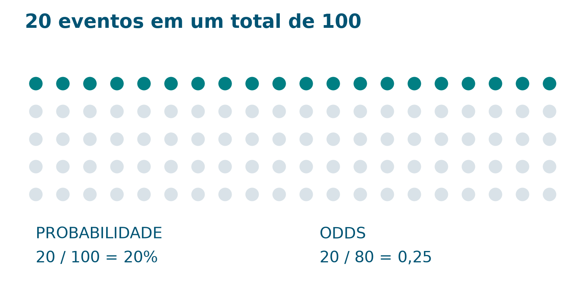
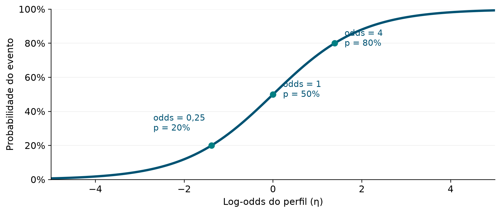
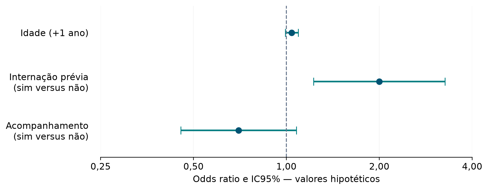

# Apresentação

Uma tabela de regressão logística costuma trazer números como **0,69**, **2,00** e **0,006**. Eles podem aparecer na mesma linha, mas respondem a perguntas diferentes. Esta apostila apresenta um caminho para compreender esses resultados sem começar pela matemática mais difícil.

O percurso será: **contagens → probabilidade → odds → odds ratio → coeficientes → interpretação em palavras**. Um caso fictício de reinternação acompanha as explicações. As fórmulas aparecem depois da ideia que representam, sempre com uma conta resolvida.

**Público sugerido:** estudantes e profissionais da saúde em contato inicial com regressão logística. **Conhecimentos prévios:** divisão, porcentagens e leitura de tabelas. **Uso proposto:** encontro de aproximadamente 2 horas, com leitura complementar. Não é necessário programar para acompanhar o núcleo da apostila.

## O que você deverá conseguir fazer

1. Reconhecer uma situação em que a regressão logística binária é pertinente.
2. Calcular e distinguir probabilidade, odds e odds ratio.
3. Interpretar o sinal de um coeficiente e transformar um coeficiente em OR.
4. Especificar o evento, a comparação, a unidade e as variáveis de ajuste.
5. Explicar por que dobrar as odds não significa dobrar a probabilidade.
6. Ler uma tabela de resultados sem transformar associação em causalidade.

## Como usar esta apostila

Leia primeiro as seções 1 a 8. Faça as pausas antes de consultar as respostas. A seção 9 acrescenta uma introdução à incerteza; a seção 10 faz a ligação opcional com o notebook do projeto. Ao final, há atividades, gabarito comentado e uma folha de consulta rápida.

**Todos os pacientes, grupos, coeficientes e resultados numéricos dos exemplos foram criados para ensino.** Não são resultados de pesquisas nem estimativas clínicas reais. As chamadas numéricas remetem às páginas dos livros fornecidos; os exemplos e as atividades são propostas pedagógicas originais.

# 1. Caso de abertura: o que significa “duas vezes”?

**Caso hipotético.** A enfermeira Ana está aprendendo a analisar reinternação em até 30 dias depois da alta. Ela recebe uma tabela com dois grupos: pessoas com e sem internação anterior nos 12 meses que antecederam a internação atual.

| Internação prévia | Reinternação em 30 dias | Sem reinternação em 30 dias | Total |
|---|---:|---:|---:|
| Não — grupo de referência | 10 | 40 | 50 |
| Sim — grupo comparado | 20 | 40 | 60 |

Ana calcula uma odds ratio de 2,00. Um colega comenta: “Então a probabilidade de reinternação é duas vezes maior”. Antes de concordar, observe os denominadores: no primeiro grupo, ocorreram 10 reinternações entre 50 pessoas; no segundo, 20 entre 60.

> **Pergunta condutora:** duas vezes o quê — o número de eventos, a probabilidade ou as odds?

Vamos resolver essa dúvida antes de interpretar qualquer coeficiente. Nesta apostila, o evento de interesse será **reinternação em até 30 dias**, codificado como **Y = 1**; a ausência desse evento no período será **Y = 0**. Definir o evento e sua codificação é o primeiro passo de uma interpretação. [[1]](#fonte-1)

## Pausa de análise

Calcule, em porcentagem, quantas pessoas reinternaram em cada grupo. Você encontrou 20% e aproximadamente 33,3%? Guarde esses resultados: eles serão usados na seção 4.

# 2. Probabilidade: eventos em relação ao total

A probabilidade expressa a possibilidade de ocorrência de um evento, numa escala de 0 a 1, ou de 0% a 100%. Em um grupo observado, a proporção de eventos é calculada dividindo o número de eventos pelo total de pessoas. Ela pode ser usada como estimativa da probabilidade naquele contexto. [[1]](#fonte-1) [[2]](#fonte-2)

No grupo sem internação prévia:

$$p = \frac{10}{50} = 0{,}20 = 20\%.$$

Em linguagem cotidiana: **20 de cada 100 pessoas**, se essa proporção fosse mantida em um grupo de 100. Isso não informa quais pessoas terão o evento, nem garante exatamente 20 eventos em uma nova amostra.

O complemento, $1-p$, representa a probabilidade de não ocorrer o evento. Se $p=0{,}20$, então $1-p=0{,}80$. As duas probabilidades somam 1 porque consideramos somente duas possibilidades: o evento ocorre ou não ocorre no período definido. [[2]](#fonte-2)

{width=15cm}

# 3. Odds: eventos em relação aos não eventos

As **odds** comparam a probabilidade do evento com a probabilidade de não evento. Em uma tabela de contagens, isso corresponde a dividir eventos por não eventos. O denominador mudou: antes era o total; agora são os não eventos. [[2]](#fonte-2) [[3]](#fonte-3)

$$\mathrm{odds} = \frac{p}{1-p}.$$

Com probabilidade de 20%:

$$\mathrm{odds} = \frac{0{,}20}{0{,}80} = 0{,}25.$$

Na tabela do caso, a mesma conta é $10/40=0{,}25$. Isso significa **um evento para cada quatro não eventos**, em termos da razão observada. Não significa probabilidade de 25%.

Alguns textos traduzem *odds* como “chance” e *odds ratio* como “razão de chances”. Como “chance” também é usada informalmente para probabilidade, manteremos os termos **odds** e **OR** para deixar o denominador explícito.

## 3.1 Uma tabela para fixar a diferença

| Probabilidade do evento | Probabilidade de não evento | Odds | Leitura da razão |
|---:|---:|---:|---|
| 10% | 90% | 0,111 | 1 evento para 9 não eventos |
| 20% | 80% | 0,25 | 1 evento para 4 não eventos |
| 50% | 50% | 1,00 | 1 evento para 1 não evento |
| 80% | 20% | 4,00 | 4 eventos para 1 não evento |

**Cálculos didáticos.** Odds podem ser maiores que 1: odds de 4 correspondem a probabilidade de 80%. Para probabilidades entre 0 e 1, as odds são positivas; quando a probabilidade se aproxima de 1, as odds crescem sem limite. Em $p=1$, a fórmula tem denominador zero. [[2]](#fonte-2)

## 3.2 Como voltar das odds para a probabilidade

$$p = \frac{\mathrm{odds}}{1+\mathrm{odds}}.$$

Se as odds forem 0,25, a probabilidade será $0{,}25/1{,}25=0{,}20$. Se forem 4, a probabilidade será $4/5=0{,}80$. Esta fórmula é uma reorganização da definição de odds. [[2]](#fonte-2)

> **Pausa de análise:** odds de 1 significam certeza do evento? Não. Significam probabilidades iguais para evento e não evento: 50% para cada um.

# 4. Odds ratio: comparar duas odds

Uma **odds ratio**, abreviada **OR**, é a divisão das odds de uma situação pelas odds de outra. A situação no denominador é a **referência da comparação**. Uma OR só fica interpretável quando sabemos o evento e a direção dessa comparação. [[3]](#fonte-3)

$$\mathrm{OR} = \frac{\mathrm{odds\ do\ grupo\ comparado}}{\mathrm{odds\ do\ grupo\ de\ referência}}.$$

## 4.1 Resolvendo o caso de Ana

| Medida | Sem internação prévia | Com internação prévia |
|---|---:|---:|
| Probabilidade estimada pela proporção | 10/50 = 20% | 20/60 ≈ 33,3% |
| Odds observadas | 10/40 = 0,25 | 20/40 = 0,50 |

Logo:

$$\mathrm{OR} = \frac{0{,}50}{0{,}25} = 2{,}00.$$

**Interpretação:** neste exemplo, as odds observadas de reinternação no grupo com internação prévia são duas vezes as do grupo sem internação prévia. Trata-se de uma **OR bruta**, calculada diretamente da tabela, sem ajuste por outras características. [[3]](#fonte-3)

A razão entre as probabilidades é diferente: $(20/60)/(10/50)\approx1{,}67$. Nesse cenário hipotético com acompanhamento por 30 dias, essa razão é o **risco relativo**. A diferença absoluta entre as probabilidades é aproximadamente **13,3 pontos percentuais**: 33,3% menos 20%. Assim, o mesmo exemplo tem OR = 2,00, risco relativo ≈ 1,67 e diferença ≈ 13,3 pontos percentuais. [[3]](#fonte-3)

## 4.2 Como ler valores acima, abaixo e iguais a 1

| OR | Interpretação das odds no grupo comparado |
|---:|---|
| 2,00 | odds duas vezes as da referência; 100% maiores |
| 1,50 | odds 1,5 vez as da referência; 50% maiores |
| 1,00 | odds iguais às da referência |
| 0,70 | odds iguais a 70% das da referência; 30% menores |
| 0,50 | odds iguais à metade das da referência; 50% menores |

A variação percentual das odds é $100\times(\mathrm{OR}-1)$. Um resultado negativo indica redução das odds. A fórmula descreve **odds**, sem converter essa variação em mudança percentual da probabilidade. [[4]](#fonte-4)

## 4.3 E se invertermos a referência?

Comparar “sem internação prévia” com “com internação prévia” produz $0{,}25/0{,}50=0{,}50$. A OR invertida é $1/\mathrm{OR}$: **2,00 e 0,50 descrevem a mesma comparação em direções opostas**. Por isso, a frase precisa dizer quem está sendo comparado com quem. Essa propriedade decorre da definição da razão. [[3]](#fonte-3)

## 4.4 Uma OR não determina sozinha a probabilidade

Suponha OR = 2. Para obter a nova probabilidade, precisamos conhecer a probabilidade de referência, $p_0$, relativa à mesma comparação. Primeiro transformamos $p_0$ em odds, multiplicamos pela OR e voltamos para probabilidade. Combinando essas etapas:

$$p_1 = \frac{\mathrm{OR}\times p_0}{1-p_0+\mathrm{OR}\times p_0}.$$

| Probabilidade de referência | OR | Probabilidade após a comparação | Diferença absoluta |
|---:|---:|---:|---:|
| 10% | 2,00 | 18,2% | +8,2 pontos percentuais |
| 20% | 2,00 | 33,3% | +13,3 pontos percentuais |
| 50% | 2,00 | 66,7% | +16,7 pontos percentuais |

**Cálculos didáticos derivados da definição de OR.** A mesma multiplicação das odds gera mudanças diferentes de probabilidade. A OR aproxima o risco relativo quando o evento é raro nos grupos comparados, mas não devemos assumir que as duas medidas são intercambiáveis. [[3]](#fonte-3)

> **Resposta ao colega de Ana:** “O resultado indica o dobro das odds. A probabilidade passa de 20% para aproximadamente 33,3%; ela não dobra.”

# 5. Onde entra a regressão logística?

A regressão logística binária relaciona um desfecho com duas possibilidades a uma ou mais características, como idade e internação prévia. Ela permite estimar a probabilidade do evento para um conjunto de valores dessas características. O termo **binária** se refere ao desfecho; as variáveis explicativas podem ser numéricas ou categóricas. [[1]](#fonte-1)

No caso de Ana, a pergunta se amplia: **como a probabilidade estimada de reinternação varia quando consideramos, em conjunto, idade, internação prévia e acompanhamento programado?**

## 5.1 Por que aparece uma curva em S?

Uma probabilidade precisa ficar entre 0 e 1. Uma soma como “intercepto + coeficiente × idade” pode assumir valores negativos ou maiores que 1. A regressão logística usa essa soma em uma escala intermediária, a **log-odds**, e depois a transforma em probabilidade. A transformação logística produz uma curva em S e mantém as probabilidades dentro do intervalo permitido. [[1]](#fonte-1)

{width=15cm}

O ponto central é simples: **a soma do modelo não é uma porcentagem**. Ela precisa ser convertida antes de receber uma interpretação de probabilidade.

## 5.2 Quatro peças da equação

Usaremos $b$ para representar um coeficiente estimado. Outros materiais podem usar B, beta ou $\hat\beta$.

$$\eta = b_0 + b_1x_1 + b_2x_2 + \cdots + b_kx_k.$$

| Símbolo | Leitura |
|---|---|
| $x_1, x_2, \ldots$ | valores das características de um perfil |
| $b_1, b_2, \ldots$ | coeficientes associados a essas características |
| $b_0$ | intercepto: ponto de partida na escala da log-odds |
| $\eta$ — “eta” | resultado da soma, igual à log-odds estimada |

As conversões são:

$$\eta = \ln\left(\frac{p}{1-p}\right), \qquad \mathrm{odds}=e^{\eta}, \qquad p=\frac{e^{\eta}}{1+e^{\eta}}.$$

$\ln$ significa logaritmo natural. A operação $\exp$, ou $e$ elevado a um número, desfaz esse logaritmo; $e$ vale aproximadamente 2,718. Não é preciso calcular logaritmos à mão: uma calculadora científica ou o programa faz essa etapa. O essencial é reconhecer em qual escala o número está. [[1]](#fonte-1) [[2]](#fonte-2)

## 5.3 De onde vêm os coeficientes?

Em uma análise, o programa estima os coeficientes a partir dos dados. No ajuste clássico, utiliza-se máxima verossimilhança: procuram-se valores sob os quais o conjunto de resultados observados seja mais plausível segundo o modelo. Aqui vamos trabalhar com coeficientes fornecidos, para concentrar a atenção na interpretação. [[10]](#fonte-10)

# 6. Coeficientes: primeiro o sinal, depois a magnitude

Em um modelo sem interação e com a variável entrando de forma linear na log-odds, o coeficiente $b_j$ descreve quanto a log-odds muda quando essa variável aumenta uma unidade, **mantendo as demais variáveis do modelo constantes**. [[4]](#fonte-4) [[5]](#fonte-5)

| Coeficiente | Para um aumento de uma unidade |
|---|---|
| $b>0$ | log-odds, odds e probabilidade estimadas do evento aumentam |
| $b<0$ | log-odds, odds e probabilidade estimadas do evento diminuem |
| $b=0$ | esse termo não altera a estimativa no contraste considerado |

O sinal indica a direção da associação no modelo. Ele não informa sozinho o tamanho da mudança na probabilidade. **Um coeficiente de 0,69 não significa aumento de 69%, nem de 69 pontos percentuais.** [[4]](#fonte-4)

## 6.1 Do coeficiente à OR

Para um aumento de uma unidade, nas condições descritas acima:

$$\mathrm{OR} = e^b = \exp(b).$$

| Coeficiente aproximado | Cálculo | OR | Leitura |
|---:|---|---:|---|
| +0,6931 | exp(0,6931) | 2,00 | odds 100% maiores |
| 0 | exp(0) | 1,00 | odds iguais |
| −0,3567 | exp(−0,3567) | 0,70 | odds 30% menores |
| −0,6931 | exp(−0,6931) | 0,50 | odds 50% menores |

**Cálculos didáticos, com arredondamento apenas na apresentação.** Um coeficiente negativo produz uma OR entre 0 e 1. A OR não fica negativa, porque a função exponencial é positiva. [[4]](#fonte-4)

> **Duas operações diferentes:** $e^{\eta}$ produz as **odds de um perfil**; $e^{b_j}$ produz a **OR para +1 unidade de uma variável**, quando esse coeficiente representa todo o contraste.

## 6.2 O intercepto também precisa de interpretação

O intercepto $b_0$ é a log-odds estimada quando todas as variáveis que entram na equação valem zero. Portanto, $e^{b_0}$ representa as odds desse perfil de referência; não é automaticamente uma OR entre grupos. [[2]](#fonte-2)

Se “idade = 0” não for um ponto útil para a análise, podemos usar “idade − 50”. Nesse caso, zero nessa variável representa uma pessoa de 50 anos. Essa **centralização** facilita a interpretação do intercepto. O significado depende dos zeros escolhidos para todas as outras variáveis. [[2]](#fonte-2)

# 7. A unidade e a referência mudam a leitura

## 7.1 Variável binária: de 0 para 1

Se internação prévia foi codificada como 0 = não e 1 = sim, e seu coeficiente é aproximadamente 0,6931, então OR = 2,00 para **sim em comparação com não**. Em um modelo com outras variáveis, a frase deve explicitar o ajuste. [[4]](#fonte-4) [[5]](#fonte-5)

**Modelo de frase:** “Mantendo idade e acompanhamento programado constantes, a presença de internação prévia está associada a odds estimadas de reinternação duas vezes as da ausência de internação prévia, segundo este modelo.”

“Manter constante” descreve a comparação matemática entre perfis com os mesmos valores das outras variáveis. Isso não significa que pessoas reais sejam idênticas em tudo, nem que todos os fatores relevantes tenham sido medidos.

## 7.2 Variável contínua: uma unidade de quê?

Suponha um coeficiente didático de 0,04 para idade em anos. Para comparar pessoas que diferem em um ano, a OR é $e^{0{,}04}\approx1{,}041$: odds cerca de 4,1% maiores, mantendo as demais variáveis constantes. [[5]](#fonte-5)

Para um incremento de $\Delta x$ unidades:

$$\mathrm{OR}_{\Delta x} = \exp(b\times\Delta x).$$

Para uma diferença de 10 anos, $\mathrm{OR}=e^{0{,}04\times10}\approx1{,}492$: odds aproximadamente 49,2% maiores. **Não se multiplica a OR de um ano por 10.** Eleva-se essa OR à décima potência, ou multiplica-se o coeficiente por 10 antes de exponenciar. [[5]](#fonte-5) [[9]](#fonte-9)

Essa regra pressupõe o mesmo incremento na log-odds por ano ao longo do intervalo comparado. Se o modelo tiver curvatura ou interação, será necessário considerar todos os termos envolvidos na comparação. [[5]](#fonte-5) [[9]](#fonte-9)

## 7.3 Categorias: declarar a referência

Uma variável com três categorias, por exemplo unidades A, B e C, pode ser representada por indicadores, tomando A como referência. Nesse caso, teremos comparações B versus A e C versus A. Os códigos 1, 2 e 3 não devem ser tratados automaticamente como uma medida numérica com distâncias iguais. [[6]](#fonte-6)

Também é necessário distinguir **idade em anos** de **código de faixa etária**. Um aumento de um código de faixa não equivale a um ano de idade. Essa distinção será retomada no notebook.

## 7.4 OR bruta e OR ajustada

A OR bruta da seção 4 compara os grupos usando somente a tabela. Uma OR ajustada vem de um modelo que inclui outras variáveis; sua interpretação é condicional aos valores dessas variáveis. As duas estimativas podem ser diferentes. O ajuste se refere às variáveis efetivamente incluídas no modelo. [[5]](#fonte-5)

**Aplicação ao caso:** a tabela inicial não considera idade. Um modelo com idade e internação prévia permite descrever a associação da internação prévia com o desfecho ao comparar perfis de mesma idade. Essa descrição estatística, por si só, não estabelece uma relação causal.

# 8. Exemplo completo: da equação à frase

**Modelo inteiramente hipotético.** Os coeficientes abaixo foram escolhidos para facilitar as contas. Eles não foram estimados a partir da tabela inicial, nem de pacientes reais. A OR de internação prévia foi fixada em 2,00 para permitir a comparação didática com o exemplo anterior.

$$\eta=-1{,}3863+0{,}0400\times(\mathrm{idade}-50)+0{,}6931\times I-0{,}3567\times A.$$

Nesta equação, **I** vale 1 para presença de internação prévia e 0 para ausência; **A** vale 1 para acompanhamento programado na alta e 0 para ausência desse acompanhamento. O evento continua sendo reinternação em até 30 dias.

| Termo | Coeficiente | Interpretação |
|---|---:|---|
| Intercepto | −1,3863 | log-odds do perfil de 50 anos, I = 0 e A = 0 |
| Idade − 50 | +0,0400 | OR ≈ 1,041 por +1 ano; ≈ 1,492 por +10 anos |
| Internação prévia — I | +0,6931 | OR = 2,00 para sim versus não |
| Acompanhamento — A | −0,3567 | OR = 0,70 para sim versus não |

As OR são condicionais: em cada comparação, mantemos as outras variáveis do modelo constantes. Os números foram arredondados na equação; os cálculos seguintes usam os valores completos escolhidos para o exemplo.

## 8.1 Passo a passo para um perfil

Considere uma pessoa de **60 anos**, **com internação prévia** e **sem acompanhamento programado**. Assim, idade − 50 = 10, I = 1 e A = 0.

1. **Calcule a log-odds:** $\eta\approx-1{,}3863+0{,}04\times10+0{,}6931=-0{,}2931$.
2. **Converta em odds:** $e^{-0{,}2931}\approx0{,}7459$.
3. **Converta em probabilidade:** $0{,}7459/(1+0{,}7459)\approx0{,}4272$.
4. **Escreva a interpretação:** segundo este modelo hipotético, a probabilidade estimada de reinternação para esse perfil é aproximadamente **42,7%**.

Observe que usamos o intercepto e todos os valores do perfil. Uma OR isolada não seria suficiente para calcular essa probabilidade. [[1]](#fonte-1) [[3]](#fonte-3)

## 8.2 Comparando perfis

| Idade | Internação prévia | Acompanhamento | Odds estimadas | Probabilidade estimada |
|---:|---|---|---:|---:|
| 50 | Não | Não | 0,2500 | 20,0% |
| 50 | Sim | Não | 0,5000 | 33,3% |
| 60 | Sim | Não | 0,7459 | 42,7% |
| 60 | Sim | Sim | 0,5221 | 34,3% |

**Cálculos do modelo hipotético.** Compare as duas últimas linhas: a única diferença é A. As odds são multiplicadas por 0,70, mas a probabilidade passa de 42,7% para 34,3% — aproximadamente 8,4 pontos percentuais a menos. Não se trata de uma redução de 30 pontos percentuais.

## 8.3 Uma interpretação completa

> “No modelo hipotético, o acompanhamento programado está associado a odds estimadas de reinternação 30% menores, comparando presença com ausência de acompanhamento e mantendo idade e internação prévia constantes.”

Essa frase descreve direção, magnitude, evento, referência e ajuste. Para avaliar a precisão da estimativa, ainda precisamos da incerteza. A associação descrita também não demonstra que oferecer acompanhamento produziria essa mudança: a pergunta causal exigiria um estudo e hipóteses adequados.

# 9. Leitura complementar: OR, intervalo de confiança e valor-p

O coeficiente e a OR são estimativas. O **intervalo de confiança de 95% — IC95%** acrescenta informação sobre a incerteza amostral, sob as hipóteses do método. O **erro-padrão — EP** quantifica a incerteza da estimativa do coeficiente. No procedimento de Wald, uma aproximação comum é calcular o intervalo na escala do coeficiente e exponenciar seus limites. [[7]](#fonte-7)

$$\mathrm{IC95\%\ da\ OR}\approx\left[\exp(b-1{,}96\times\mathrm{EP}),\ \exp(b+1{,}96\times\mathrm{EP})\right].$$

## 9.1 Ler uma linha de cada vez

**Tabela didática.** Acrescentamos erros-padrão escolhidos apenas para exercitar a interpretação do modelo da seção 8. Os intervalos e valores-p foram calculados a partir desses números pelo método de Wald, com aproximação normal bilateral. Não representam inferência sobre uma amostra real.

| Variável / comparação | b | EP | OR | IC95% da OR | Valor-p |
|---|---:|---:|---:|---|---:|
| Idade: +1 ano | 0,0400 | 0,025 | 1,04 | 0,99–1,09 | 0,110 |
| Internação prévia: sim versus não | 0,6931 | 0,250 | 2,00 | 1,23–3,26 | 0,006 |
| Acompanhamento: sim versus não | −0,3567 | 0,220 | 0,70 | 0,45–1,08 | 0,105 |

**Internação prévia:** a estimativa aponta odds duas vezes maiores; o intervalo vai de aproximadamente 1,23 a 3,26. O IC95% exclui 1 e o valor-p é menor que 0,05. Nesse teste, há evidência contra a hipótese de OR = 1.

**Acompanhamento:** a estimativa pontual aponta odds 30% menores, mas o intervalo inclui 1. Os números são compatíveis com odds menores e também com uma pequena elevação. A evidência é insuficiente para rejeitar OR = 1 a 5%; isso não prova ausência de associação.

{width=15cm}

## 9.2 O que cada informação responde

| Informação | Pergunta que ajuda a responder |
|---|---|
| Sinal de b | Qual é a direção da associação no modelo? |
| OR e comparação | Por quanto as odds são multiplicadas? |
| IC95% | Qual é a incerteza da estimativa sob o método adotado? |
| Valor-p | Quão incompatíveis são os dados com a hipótese nula, segundo o teste? |

Na interpretação frequentista, o procedimento de construção de IC95% cobre o parâmetro em cerca de 95% das repetições do estudo sob suas hipóteses. **O intervalo calculado não significa que 95% dos pacientes estejam entre seus limites.** Tampouco o valor-p representa a probabilidade de a hipótese nula ser verdadeira.

No teste de Wald bilateral correspondente, IC95% excluindo 1 acompanha valor-p menor que 0,05, salvo diferenças de arredondamento. Significância estatística não informa sozinha a importância clínica, a qualidade das previsões ou a causalidade. A leitura da tabela deve reunir magnitude, incerteza e contexto. [[7]](#fonte-7) [[8]](#fonte-8)

# 10. Ponte opcional com o notebook do projeto

O notebook **02 — Regressão logística: versão mínima** trabalha com outro desfecho e outros dados. Conforme documentado nele, a classe 1 reúne pré-diabetes/diabetes; a classe 0 corresponde à ausência de diabetes. Portanto, ao passar desta apostila ao notebook, substitua o evento da frase de interpretação. [[8]](#fonte-8)

## 10.1 O coeficiente pode estar em uma escala padronizada

No notebook, as variáveis do modelo preditivo passam por `StandardScaler`. Para uma variável não constante, a transformação é $z=(x-\mu)/s$, em que $\mu$ e $s$ são aprendidos nos dados de treino. Um coeficiente $b_z$ se refere a **uma unidade de z**, correspondente à escala de um desvio-padrão do treino. [[8]](#fonte-8)

Para voltar à unidade original, usamos:

$$b_x=\frac{b_z}{s}, \qquad \mathrm{OR}_{\Delta x}=\exp\left(\frac{b_z}{s}\times\Delta x\right).$$

**Exemplo hipotético:** se o coeficiente padronizado do IMC for 0,40 e a escala for 5 kg/m², então:

- por +5 kg/m², a OR é $e^{0{,}40}\approx1{,}49$;
- por +1 kg/m², a OR é $e^{0{,}40/5}\approx1{,}083$.

As duas OR descrevem o mesmo coeficiente em incrementos diferentes. Não escolha uma delas sem declarar a unidade.

## 10.2 Três cuidados ao ler as tabelas

1. **Variáveis binárias padronizadas:** um desvio-padrão não equivale à mudança de 0 para 1. Para `HighBP`, interprete a comparação 1 versus 0 usando o coeficiente convertido à escala original.
2. **Variáveis ordinais:** `Age` é um código de faixa etária. Um passo no código não significa um ano. O notebook também mantém `GenHlth`, `Education` e `Income` como códigos numéricos, assumindo incremento constante na log-odds por passo.
3. **Dois ajustes diferentes:** as probabilidades do pipeline vêm de um modelo regularizado. A tabela final com IC95% e valores-p vem de um ajuste sem penalização. Cada OR deve ser lida com o intervalo e o valor-p do próprio ajuste. [[8]](#fonte-8)

Para reconstruir probabilidades na escala original, também é necessário converter o intercepto. O notebook já faz essa conversão. Dividir os coeficientes pela escala não remove a regularização do modelo.

**Limite registrado no notebook:** o ajuste inferencial usa erros-padrão HC0 e não incorpora pesos, estratos ou conglomerados do inquérito de origem. Seus testes são exploratórios e não substituem uma análise do desenho amostral. [[8]](#fonte-8)

# 11. Oficina: interpretar antes de concluir

**Proposta pedagógica.** Trabalhe em duplas por 20 minutos. Use calculadora apenas depois de prever a direção do resultado. Registre as respostas em frases completas e consulte o gabarito ao final.

## Atividade 1 — Qual é o denominador?

Em um grupo fictício de 100 pessoas, 30 apresentam o evento e 70 não. Calcule a proporção de eventos e as odds. Explique por que os resultados são diferentes.

## Atividade 2 — Comparando grupos

O grupo A tem 15 eventos e 45 não eventos. O grupo B tem 10 eventos e 60 não eventos. Use B como referência. Calcule a OR e escreva uma frase sem usar “probabilidade duas vezes maior”.

## Atividade 3 — Traduzindo um coeficiente

Uma variável binária, codificada como 1 = presente e 0 = ausente, tem $b=-0{,}6931$. Calcule a OR e a variação percentual das odds. A OR pode ser negativa?

## Atividade 4 — Interpretando uma unidade maior

Em um modelo hipotético, o coeficiente do IMC é 0,08 por kg/m². Qual é a OR para +1 kg/m²? E para +5 kg/m²? Explicite o ajuste pelas demais variáveis na sua frase.

## Atividade 5 — A OR basta?

Uma comparação tem OR = 3,00 e probabilidade de referência de 10%. Calcule a probabilidade da situação comparada. Ela é 30%?

## Atividade 6 — Lendo a incerteza

Uma tabela informa OR = 0,80 e IC95% de 0,55 a 1,16. Um colega conclui: “Foi demonstrada uma redução das odds”. Reescreva a conclusão considerando a estimativa pontual e o intervalo.

## Atividade 7 — Retorno ao modelo de Ana

Use a seção 8 para comparar os perfis de 50 anos com e sem internação prévia, ambos sem acompanhamento. Informe: evento, comparação, OR, probabilidades e diferença em pontos percentuais. Termine com uma frase sobre o que esses números não demonstram.

## Atividade 8 — Coeficiente padronizado

Uma variável binária padronizada tem coeficiente 0,35 e escala de treino 0,50. Qual é a OR para a mudança de 0 para 1 na variável original? Por que $e^{0{,}35}$ responderia a outra comparação?

# 12. Gabarito comentado

**1. Denominador.** Proporção = $30/100=30\%$. Odds = $30/70\approx0{,}429$. A proporção usa todas as pessoas no denominador; as odds usam apenas os não eventos. Odds de 0,429 não significam probabilidade de 42,9%.

**2. Comparação.** Odds de A = $15/45=1/3$; odds de B = $10/60=1/6$. A OR de A em relação a B é 2,00. “As odds observadas do evento em A são duas vezes as de B.” A comparação é bruta. As proporções são 25% e aproximadamente 14,3%, cuja razão é 1,75.

**3. Coeficiente negativo.** $e^{-0{,}6931}\approx0{,}50$. A presença da característica está associada a odds aproximadamente 50% menores, comparada à ausência, mantendo as demais variáveis constantes. A OR é positiva; negativo é o coeficiente na escala da log-odds.

**4. IMC.** Para +1 kg/m², $e^{0{,}08}\approx1{,}083$: odds 8,3% maiores. Para +5 kg/m², $e^{0{,}40}\approx1{,}492$: odds 49,2% maiores. As interpretações mantêm as demais variáveis constantes e pressupõem linearidade do termo de IMC na log-odds, sem interação que altere esse contraste.

**5. Probabilidade.** As odds de referência são $0{,}10/0{,}90=1/9$. Multiplicando por 3, obtemos odds de $1/3$. A probabilidade é $(1/3)/(1+1/3)=0{,}25=25\%$. Triplicar as odds não triplica a probabilidade.

**6. Incerteza.** “A estimativa pontual sugere odds 20% menores, mas o IC95% inclui 1 e vai de odds 45% menores a 16% maiores. A evidência é insuficiente para rejeitar OR = 1 a 5% no teste bilateral correspondente.” Não se conclui ausência de associação nem redução estabelecida.

**7. Modelo de Ana.** Evento: reinternação em até 30 dias. Comparação: presença versus ausência de internação prévia, mantendo idade em 50 anos e acompanhamento ausente. OR = 2,00. Probabilidades: 33,3% versus 20,0%; diferença ≈ 13,3 pontos percentuais. São resultados de um modelo fictício e não demonstram causalidade.

**8. Padronização.** O coeficiente original é $0{,}35/0{,}50=0{,}70$. Para 0 → 1, a OR é $e^{0{,}70}\approx2{,}014$: odds cerca de 101,4% maiores. Já $e^{0{,}35}\approx1{,}419$ corresponde a uma unidade padronizada, equivalente a 0,50 unidade original nesse exemplo.

# 13. Folha de consulta rápida

## Cinco perguntas antes de escrever

1. **Evento:** qual resultado foi codificado como 1?
2. **Comparação:** qual grupo ou valor é comparado com qual referência?
3. **Unidade:** +1 ano, +10 anos, +1 código, 0 → 1 ou +1 desvio-padrão?
4. **Ajuste:** quais outras variáveis são mantidas constantes no modelo?
5. **Resultado:** qual é a OR, qual é a incerteza e até onde a conclusão pode ir?

## Fórmulas essenciais

| Para obter… | Use… |
|---|---|
| Odds a partir de p | $p/(1-p)$ |
| Probabilidade a partir das odds | $\mathrm{odds}/(1+\mathrm{odds})$ |
| OR entre dois grupos | odds do comparado / odds da referência |
| OR para +1 unidade | $e^b$ |
| OR para um incremento $\Delta x$ | $e^{b\Delta x}$ |
| Variação percentual das odds | $100(\mathrm{OR}-1)$ |
| Odds de um perfil | $e^{\eta}$, usando a equação completa |

As fórmulas de OR baseadas em um único coeficiente pressupõem que ele represente todo o contraste, sem outros termos de interação ou curvatura envolvidos. [[4]](#fonte-4) [[5]](#fonte-5) [[9]](#fonte-9)

## Frase para preencher

> “Mantendo **[variáveis de ajuste]** constantes, **[comparação e unidade]** está associada a odds estimadas de **[evento]** multiplicadas por **[OR]**, ou **[percentual]** maiores/menores, segundo este modelo. O IC95% é **[limites]**, indicando **[leitura da incerteza]**.”

Se a OR for 1, substitua a variação percentual por “odds estimadas iguais no contraste considerado”. Se não houver intervalo disponível, registre essa ausência.

## Pequeno glossário

| Termo | Significado nesta apostila |
|---|---|
| Desfecho | resultado que o modelo procura descrever ou prever |
| Preditor | característica usada na equação do modelo |
| Probabilidade | possibilidade de evento na escala de 0 a 1 |
| Odds | razão entre probabilidade de evento e de não evento |
| OR | razão entre duas odds |
| Logit / log-odds | logaritmo natural das odds |
| Coeficiente | mudança na log-odds por unidade, nas condições do modelo |
| Intercepto | log-odds do perfil em que os preditores valem zero |
| Ajuste | consideração conjunta das variáveis incluídas no modelo |
| IC95% | intervalo que expressa incerteza pelo procedimento adotado |

## Autoavaliação

Antes de encerrar, tente explicar sem fórmulas: **por que odds de 0,25 equivalem a probabilidade de 20%? Por que OR = 2 não significa probabilidade duas vezes maior? Por que o mesmo coeficiente pode gerar OR diferentes quando mudamos a unidade da comparação?**

# Fontes citadas

As referências abaixo identificam as páginas efetivamente consultadas. Em Hosmer e Lemeshow, a página impressa difere do contador do PDF: **página do PDF = página impressa + 21**, nos trechos citados. Em Garson, as páginas citadas coincidem com o contador do arquivo.

**Obras fornecidas.** HOSMER, David W.; LEMESHOW, Stanley. *Applied Logistic Regression*. 2. ed. Wiley, **2000**. O nome do arquivo contém “2009”, mas a ficha editorial do livro, na página 5 do PDF, registra copyright de 2000. GARSON, G. David. *Logistic Regression: Binary and Multinomial*. Statistical Associates Publishing, **2014**. ISBN 978-1-62638-024-0.

1. []{#fonte-1} **Hosmer e Lemeshow (2000), p. 5–7; PDF p. 26–28.** Limites da probabilidade, função logística, transformação logit e desfecho codificado em 0/1. Complemento: **Garson (2014), p. 12 e 15–16**, regressão logística binária e tipos de variáveis.
2. []{#fonte-2} **Garson (2014), p. 17–18 e 158.** Probabilidade, odds, log-odds, equação e intercepto. As conversões numéricas são derivações algébricas dessas definições.
3. []{#fonte-3} **Hosmer e Lemeshow (2000), p. 49–52; PDF p. 70–73.** Definição de OR, comparação de odds, tabela 2 × 2, relação com coeficiente e distinção entre OR e risco relativo.
4. []{#fonte-4} **Hosmer e Lemeshow (2000), p. 48–50; PDF p. 69–71.** Coeficiente como diferença de logits e OR = exp(b). Complemento: **Garson (2014), p. 20 e 156**, sinal e conversão entre b e OR.
5. []{#fonte-5} **Hosmer e Lemeshow (2000), p. 63–65; PDF p. 84–86.** Unidade de variáveis contínuas, OR para incrementos e interpretação em modelos com múltiplas variáveis.
6. []{#fonte-6} **Hosmer e Lemeshow (2000), p. 56; PDF p. 77.** Variáveis explicativas com múltiplas categorias, indicadores e referência.
7. []{#fonte-7} **Hosmer e Lemeshow (2000), p. 17–18, 52 e 63; PDF p. 38–39, 73 e 84.** Intervalos para coeficientes, incerteza na OR e exponenciação dos limites. Complemento: **notebook do projeto, seção 5.3**, leitura de valor-p e IC95%.
8. []{#fonte-8} **Material local do projeto:** [02 — Regressão logística: versão mínima](../../notebooks/02_aprendizado_supervisionado_versão_minima.ipynb), apresentação e seções 4, 5.1, 5.2 e 5.3, versão consultada em 14/09/2026. Fonte da ponte com a atividade prática: alvo, padronização, conversão de escala, regularização, ajuste inferencial e limites. Nenhum resultado desse notebook foi apresentado como se tivesse sido calculado nesta apostila.
9. []{#fonte-9} **Garson (2014), p. 157–158**, incrementos e interações. **Hosmer e Lemeshow (2000), p. 70–71; PDF p. 91–92**, dependência da associação em relação a outra variável quando há interação.
10. []{#fonte-10} **Garson (2014), p. 43**, estimação por máxima verossimilhança.

# Apêndice — Proposta de uso em aula e rastreabilidade

## Roteiro sugerido de 120 minutos

| Tempo | Percurso | Produto do estudante |
|---|---|---|
| 0–10 min | Caso de abertura | interpretação inicial de “duas vezes” |
| 10–35 min | Probabilidade, odds e OR | contas das seções 2 a 4 |
| 35–60 min | Modelo e coeficientes | tradução de b em OR |
| 60–80 min | Unidade, referência e exemplo completo | uma interpretação escrita |
| 80–90 min | Introdução ao IC95% | leitura de uma linha da tabela |
| 90–110 min | Oficina em duplas | respostas às atividades 1 a 7 |
| 110–120 min | Discussão e autoavaliação | revisão da frase inicial |

**Extensão opcional:** usar a seção 10 e a atividade 8 junto ao notebook. O roteiro e os tempos são propostas pedagógicas; podem ser ajustados à familiaridade da turma com porcentagens.

## Critérios para revisar a resposta do estudante

Uma resposta satisfatória identifica o evento e a referência, usa a unidade correta, distingue odds de probabilidade, explicita as variáveis de ajuste quando cabível e considera a incerteza disponível. Uma resposta com a conta correta, mas que chama OR de risco relativo sem justificativa, precisa ser revisada.

## Matriz de rastreabilidade

| Objetivo | Seções / atividade | Base |
|---|---|---|
| Reconhecer o desfecho binário | 1 e 5 | [1] e [10] |
| Distinguir probabilidade, odds e OR | 2–4; atividades 1, 2 e 5 | [2] e [3] |
| Interpretar coeficientes e intercepto | 5–6; atividade 3 | [1], [2] e [4] |
| Declarar unidade, referência e ajuste | 7–8; atividades 4 e 7 | [4], [5], [6] e [9] |
| Ler incerteza | 9; atividade 6 | [7] e [8] |
| Transferir ao notebook | 10; atividade 8 | [8] |

**Escopo da simplificação.** O núcleo trata da interpretação de modelos binários com termos lineares na log-odds e sem interações. Seleção de variáveis, diagnóstico de ajuste, separação, validação preditiva, análise do desenho amostral e métodos de inferência causal exigem estudo adicional. Os cálculos ilustram as relações matemáticas; não avaliam a adequação de um modelo para uso em saúde.
